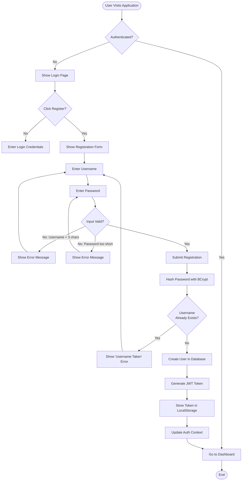
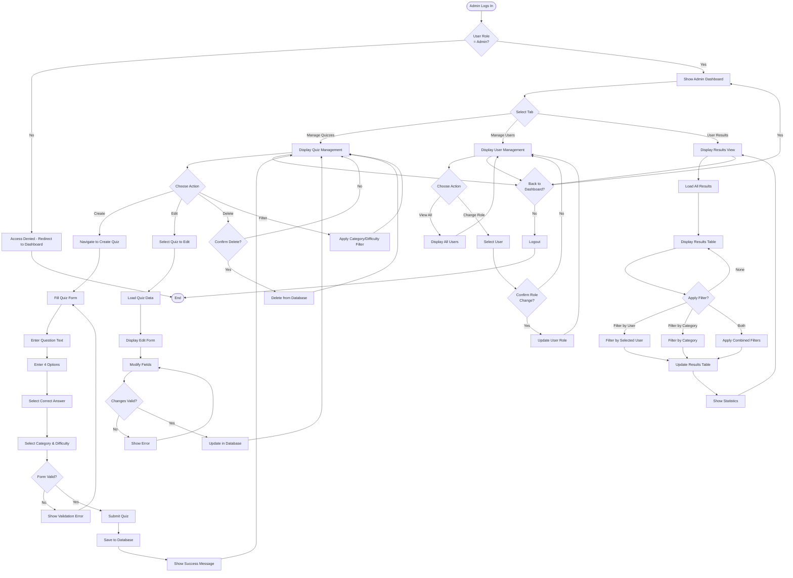
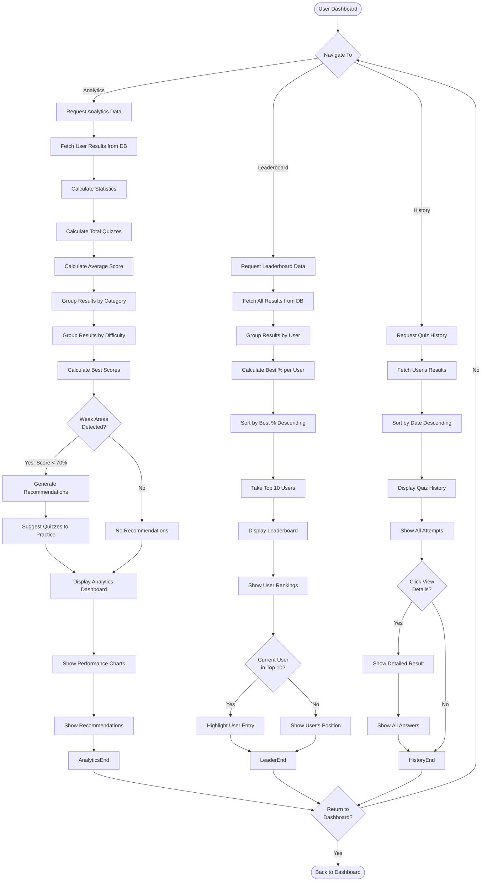

# Activity Diagram - Quiz Application

## 1. User Registration Activity Diagram

## 2. Taking a Quiz Activity Diagram

```mermaid
flowchart TD
    Start([User Logged In]) --> ViewDashboard[View Quiz Dashboard]
    ViewDashboard --> SelectCategory{Select Category<br/>Filter?}
    
    SelectCategory -->|Yes| FilterByCat[Apply Category Filter]
    FilterByCat --> SelectDiff{Select Difficulty<br/>Filter?}
    
    SelectCategory -->|No| SelectDiff
    
    SelectDiff -->|Yes| FilterByDiff[Apply Difficulty Filter]
    FilterByDiff --> ShowFiltered[Display Filtered Quizzes]
    
    SelectDiff -->|No| ShowAll[Display All Quizzes]
    ShowAll --> ShowFiltered
    
    ShowFiltered --> ClickStart[Click 'Start Quiz' Button]
    ClickStart --> FetchQuestions[Fetch Quiz Questions from API]
    FetchQuestions --> InitQuiz[Initialize Quiz State]
    InitQuiz --> ShowQuestion[Display First Question]
    
    ShowQuestion --> UserSelect[User Selects Answer]
    UserSelect --> StoreAnswer[Store Answer in State]
    StoreAnswer --> CheckMore{More Questions?}
    
    CheckMore -->|Yes| ClickNext[Click 'Next']
    ClickNext --> ShowQuestion
    
    CheckMore -->|No| ReviewAnswers{Want to Review?}
    ReviewAnswers -->|Yes| ShowSummary[Show Answer Summary]
    ShowSummary --> ConfirmSubmit{Confirm Submit?}
    ConfirmSubmit -->|No| ShowQuestion
    
    ReviewAnswers -->|No| ConfirmSubmit
    ConfirmSubmit -->|Yes| CalcScore[Calculate Score]
    
    CalcScore --> SubmitResult[Submit Result to API]
    SubmitResult --> SaveDB[Save Result in Database]
    SaveDB --> CheckBadges[Check Badge Conditions]
    
    CheckBadges --> EvalFirstQuiz{First Quiz<br/>Completed?}
    EvalFirstQuiz -->|Yes| AwardFirst[Award 'First Quiz' Badge]
    EvalFirstQuiz -->|No| EvalPerfect
    
    AwardFirst --> EvalPerfect{Score = 100%?}
    EvalPerfect -->|Yes| AwardPerfect[Award 'Perfect Score' Badge]
    EvalPerfect -->|No| EvalTopScorer
    
    AwardPerfect --> EvalTopScorer{Score >= 90%?}
    EvalTopScorer -->|Yes| AwardTop[Award 'Top Scorer' Badge]
    EvalTopScorer -->|No| EvalVeteran
    
    AwardTop --> EvalVeteran{Total Quizzes >= 10?}
    EvalVeteran -->|Yes| AwardVeteran[Award 'Quiz Veteran' Badge]
    EvalVeteran -->|No| EvalSeeker
    
    AwardVeteran --> EvalSeeker{Categories >= 3?}
    EvalSeeker -->|Yes| AwardSeeker[Award 'Knowledge Seeker' Badge]
    EvalSeeker -->|No| ShowResults
    
    AwardSeeker --> ShowResults[Display Results Page]
    ShowResults --> GenCert[Generate Certificate]
    GenCert --> ShowCert[Display Certificate]
    ShowCert --> ShowScore[Show Score & Breakdown]
    ShowScore --> ShowNewBadges{New Badges<br/>Earned?}
    
    ShowNewBadges -->|Yes| DisplayBadges[Display New Badges]
    ShowNewBadges -->|No| NextAction
    
    DisplayBadges --> NextAction{User Action?}
    NextAction -->|View History| GoHistory[Navigate to Quiz History]
    NextAction -->|Take Another| ViewDashboard
    NextAction -->|View Analytics| GoAnalytics[Navigate to Analytics]
    
    GoHistory --> End([End])
    GoAnalytics --> End
```

## 3. Admin Quiz Management Activity Diagram

## 4. View Analytics and Leaderboard Activity Diagram

## Key Activity Flow Characteristics

### Decision Points
- **Authentication Checks**: Verify user is logged in before accessing protected features
- **Role Verification**: Ensure admin privileges for management functions
- **Validation Gates**: Validate user input at multiple points
- **Conditional Badge Awards**: Evaluate badge conditions after quiz completion

### Parallel Activities
- Multiple filters can be applied simultaneously (category + difficulty)
- Badge checks happen concurrently during result submission
- Statistics calculations occur in parallel during analytics generation

### Loop Structures
- Question iteration during quiz taking
- Filter application on dashboard
- Review and correction of form inputs

### Error Handling
- Validation errors redirect back to input stage
- Authentication failures redirect to login
- Authorization failures redirect to appropriate page

### State Transitions
- Unauthenticated → Authenticated (via login/register)
- Quiz Selection → Quiz Taking → Results Viewing
- Dashboard → Admin Panel (for admins only)
- Results → Badge Award (conditional)
