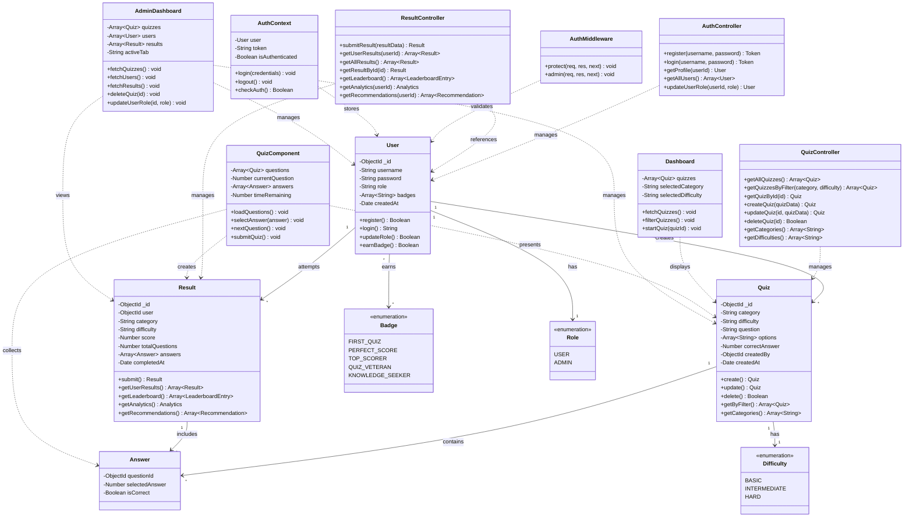

# Class Diagram - Quiz Application

## Class Descriptions

### Core Models

#### User
Represents a registered user in the system.
- **Attributes**:
  - `_id`: Unique identifier
  - `username`: Unique username (min 3 characters)
  - `password`: Hashed password using bcryptjs
  - `role`: Either 'user' or 'admin'
  - `badges`: Array of achievement badges
  - `createdAt`: Registration timestamp
- **Methods**:
  - `register()`: Create new user account
  - `login()`: Authenticate and return JWT token
  - `updateRole()`: Change user's role (admin only)
  - `earnBadge()`: Award achievement badge

#### Quiz
Represents a quiz question with multiple-choice options.
- **Attributes**:
  - `_id`: Unique identifier
  - `category`: Subject category (HTML, CSS, JavaScript, etc.)
  - `difficulty`: Basic, Intermediate, or Hard
  - `question`: The question text
  - `options`: Array of 4 possible answers
  - `correctAnswer`: Index (0-3) of correct option
  - `createdBy`: Reference to User who created it
  - `createdAt`: Creation timestamp
- **Methods**:
  - `create()`: Add new quiz question
  - `update()`: Modify existing question
  - `delete()`: Remove question
  - `getByFilter()`: Filter by category/difficulty
  - `getCategories()`: Get all unique categories

#### Result
Represents a completed quiz attempt by a user.
- **Attributes**:
  - `_id`: Unique identifier
  - `user`: Reference to User
  - `category`: Quiz category
  - `difficulty`: Quiz difficulty level
  - `score`: Number of correct answers
  - `totalQuestions`: Total questions in quiz
  - `answers`: Array of Answer objects
  - `completedAt`: Completion timestamp
- **Methods**:
  - `submit()`: Save quiz results
  - `getUserResults()`: Get user's history
  - `getLeaderboard()`: Get top performers
  - `getAnalytics()`: Get performance stats
  - `getRecommendations()`: Suggest quizzes

#### Answer
Represents a single answer in a quiz attempt.
- **Attributes**:
  - `questionId`: Reference to Quiz question
  - `selectedAnswer`: User's selected option (0-3)
  - `isCorrect`: Whether answer was correct

### Enumerations

#### Badge
Achievement badges users can earn:
- `FIRST_QUIZ`: Complete first quiz
- `PERFECT_SCORE`: Score 100% on any quiz
- `TOP_SCORER`: Score ≥90% on any quiz
- `QUIZ_VETERAN`: Complete 10 or more quizzes
- `KNOWLEDGE_SEEKER`: Complete quizzes in 3+ categories

#### Role
User access levels:
- `USER`: Regular user with standard permissions
- `ADMIN`: Administrator with full access

#### Difficulty
Quiz difficulty levels:
- `BASIC`: Entry-level questions
- `INTERMEDIATE`: Medium difficulty
- `HARD`: Advanced questions

### Controllers

#### AuthController
Handles authentication and user management.
- Registers new users
- Authenticates credentials
- Manages JWT tokens
- Updates user roles (admin only)

#### QuizController
Manages quiz CRUD operations.
- Creates, reads, updates, deletes quizzes
- Filters quizzes by category and difficulty
- Returns available categories and difficulties

#### ResultController
Handles quiz results and analytics.
- Saves quiz results
- Retrieves user history
- Generates leaderboards
- Provides analytics and recommendations

### Middleware

#### AuthMiddleware
Security middleware for API protection.
- `protect()`: Validates JWT token
- `admin()`: Checks for admin role

### Frontend Components

#### AuthContext
React context for authentication state management.
- Stores current user and token
- Provides login/logout functions
- Manages authentication status

#### Dashboard
Main user interface for quiz browsing.
- Displays available quizzes
- Filters by category and difficulty
- Initiates quiz sessions

#### QuizComponent
Interactive quiz-taking interface.
- Presents questions sequentially
- Tracks answers
- Submits results

#### AdminDashboard
Administrative control panel.
- Manages quizzes (CRUD)
- Manages users and roles
- Views all user results

## Relationships

### One-to-Many
- User → Results: One user can have many quiz attempts
- User → Quizzes: One user (admin) can create many quizzes
- Quiz → Answers: One quiz question can have many answers (in different attempts)
- Result → Answers: One result contains many answers

### Many-to-Many
- User ↔ Badges: Users can earn multiple badges; same badge can be earned by multiple users

### Composition
- Result ⊙ Answer: Answers cannot exist without a Result

### Association
- Quiz uses Difficulty: Every quiz has a difficulty level
- User has Role: Every user has exactly one role
