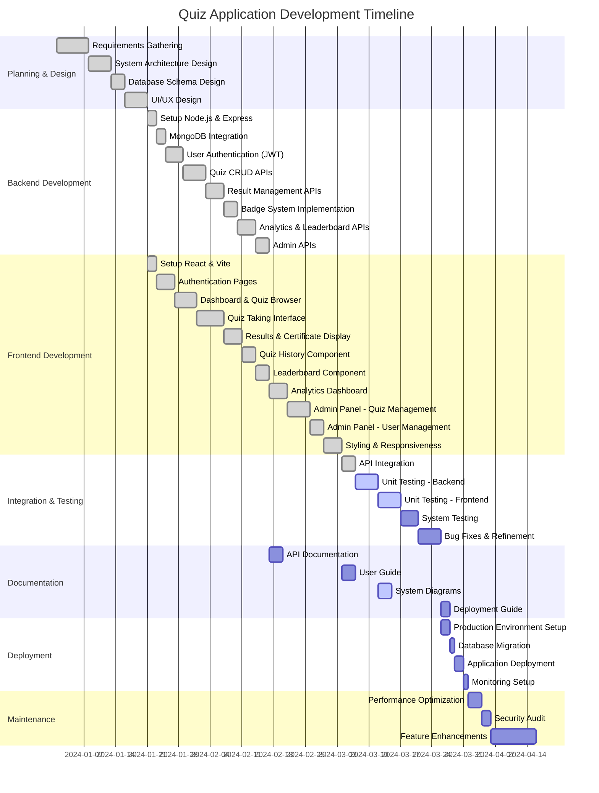

# Gantt Chart - Quiz Application Development

## Project Phases Summary

### Phase 1: Planning & Design (20 days)
- Requirements analysis
- System architecture planning
- Database schema design
- UI/UX mockups and wireframes

### Phase 2: Backend Development (27 days)
- Server setup with Node.js and Express
- MongoDB database integration
- JWT-based authentication system
- RESTful API development for quizzes, results, analytics
- Badge system implementation
- Admin-specific endpoints

### Phase 3: Frontend Development (43 days)
- React application setup with Vite
- Authentication UI (Login/Register)
- Main dashboard with filtering
- Interactive quiz interface
- Results display with certificate generation
- History, leaderboard, and analytics views
- Complete admin panel for content and user management
- Responsive design implementation

### Phase 4: Integration & Testing (19 days)
- Frontend-backend integration
- Unit testing for all components and APIs
- System/E2E testing
- Bug fixing and refinement

### Phase 5: Documentation (11 days - parallel with development)
- API documentation
- User guides
- System diagrams and architecture docs
- Deployment procedures

### Phase 6: Deployment (6 days)
- Production environment configuration
- Database migration
- Application deployment
- Monitoring and logging setup

### Phase 7: Maintenance (15 days - ongoing)
- Performance tuning
- Security hardening
- Feature enhancements based on user feedback

## Critical Path
The critical path follows: Planning → Backend Development → Frontend Development → Integration & Testing → Deployment

Total estimated time: **110 days** (approximately 4-5 months)
