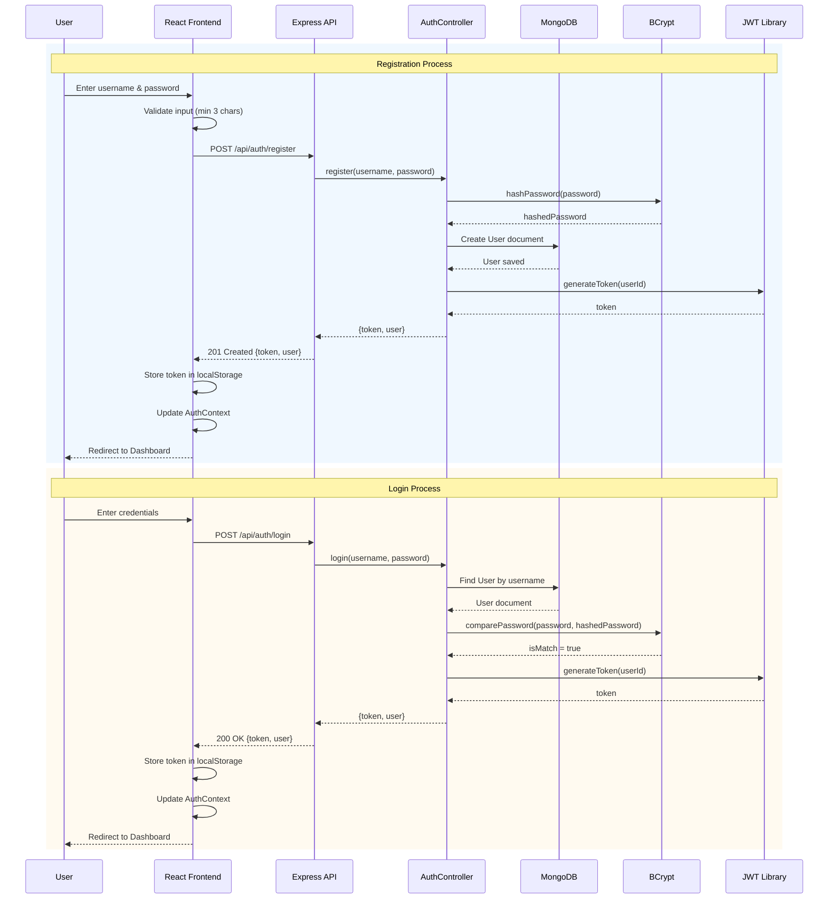
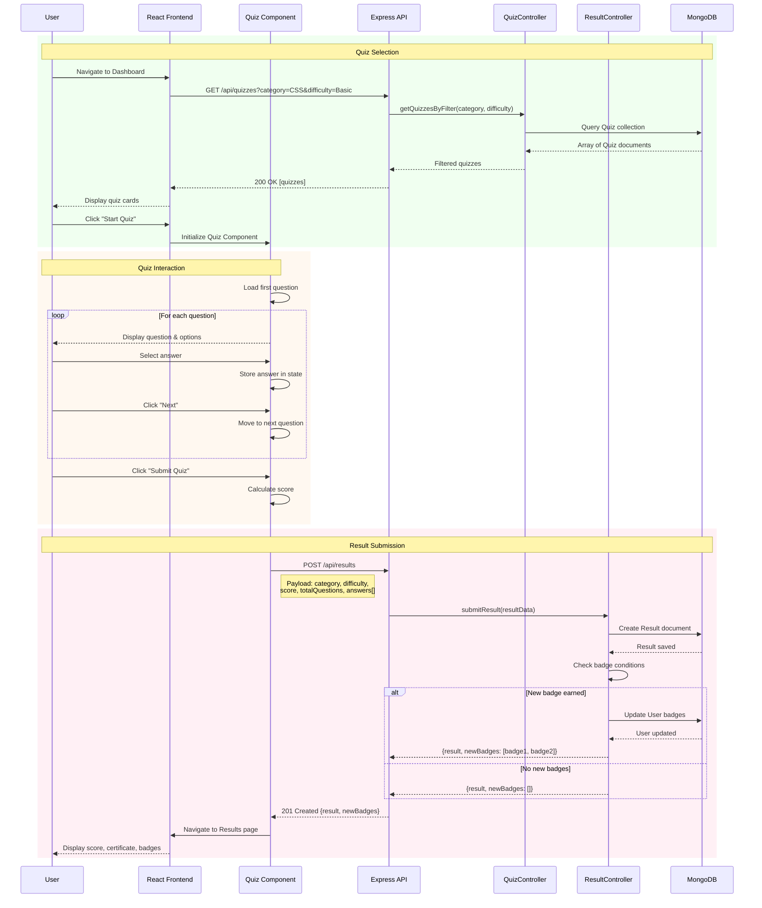
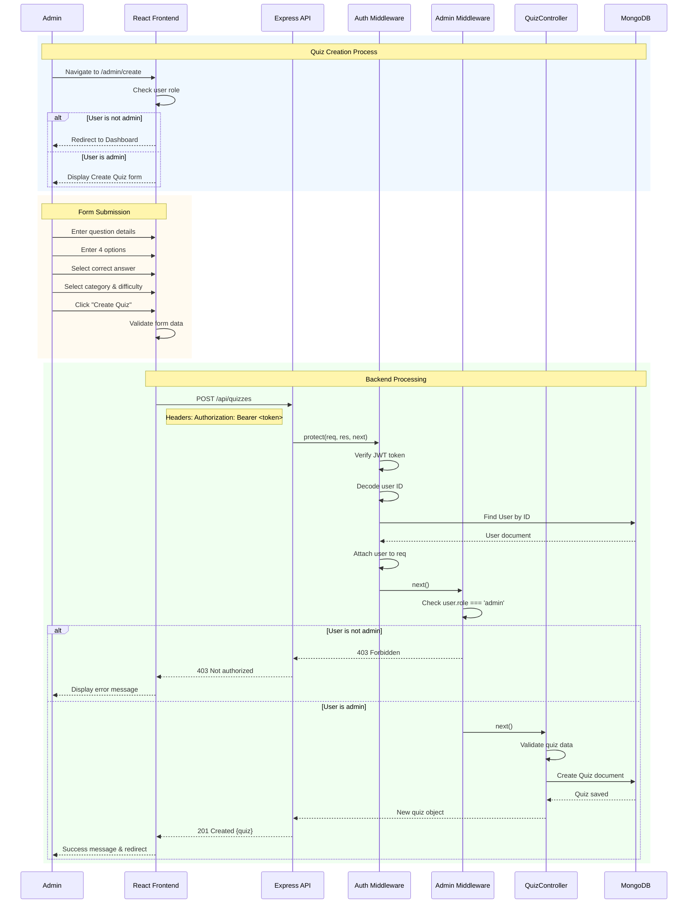
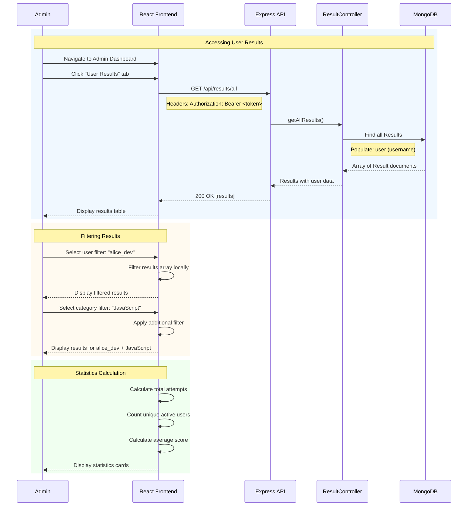
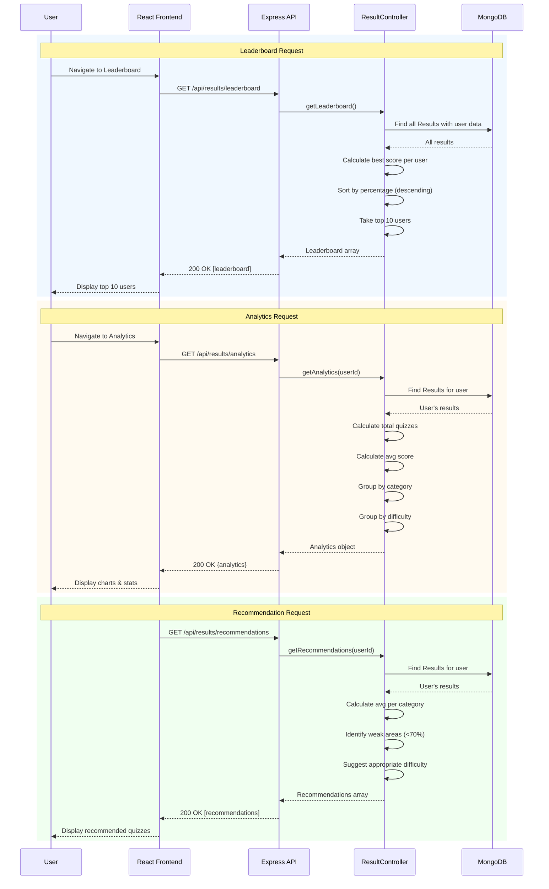

# Sequence Diagrams - Quiz Application

## 1. User Registration and Login Flow

## 2. Taking a Quiz and Viewing Results

## 3. Admin Creating a Quiz

## 4. Viewing User Results (Admin)

## 5. Leaderboard and Analytics

## Key Sequence Flow Patterns

### Authentication Flow
1. User submits credentials
2. Frontend validates input
3. API receives request
4. Controller queries database
5. Password verification (bcrypt)
6. JWT token generation
7. Token stored in localStorage
8. User redirected to protected route

### Protected Route Flow
1. Frontend sends request with JWT
2. Auth middleware validates token
3. User data attached to request
4. Admin middleware checks role (if needed)
5. Controller processes request
6. Database operation performed
7. Response sent to frontend

### Data Flow Pattern
1. User interaction triggers event
2. Component updates local state
3. API call made to backend
4. Middleware validates authentication
5. Controller processes business logic
6. Database query executed
7. Response formatted and returned
8. Frontend updates UI with data
