# Use Case Diagram - Quiz Application

```mermaid
graph TB
    User((User))
    Admin((Admin))
    Guest((Guest))
    
    subgraph "Quiz Application System"
        UC1[Register Account]
        UC2[Login to System]
        UC3[Browse Quiz Categories]
        UC4[Filter by Difficulty]
        UC5[Take Quiz]
        UC6[View Results]
        UC7[View Quiz History]
        UC8[View Leaderboard]
        UC9[View Analytics]
        UC10[Earn Badges]
        UC11[Get Recommendations]
        UC12[Create Quiz]
        UC13[Edit Quiz]
        UC14[Delete Quiz]
        UC15[Manage Users]
        UC16[View User Results]
        UC17[Update User Roles]
    end
    
    %% Guest use cases
    Guest -->|performs| UC1
    Guest -->|performs| UC2
    
    %% User use cases
    User -->|performs| UC2
    User -->|performs| UC3
    User -->|performs| UC4
    User -->|performs| UC5
    User -->|performs| UC6
    User -->|performs| UC7
    User -->|performs| UC8
    User -->|performs| UC9
    User -->|performs| UC10
    User -->|performs| UC11
    
    %% Admin use cases (inherits all User capabilities)
    Admin -->|performs| UC2
    Admin -->|performs| UC3
    Admin -->|performs| UC4
    Admin -->|performs| UC5
    Admin -->|performs| UC6
    Admin -->|performs| UC7
    Admin -->|performs| UC8
    Admin -->|performs| UC9
    Admin -->|performs| UC10
    Admin -->|performs| UC11
    Admin -->|performs| UC12
    Admin -->|performs| UC13
    Admin -->|performs| UC14
    Admin -->|performs| UC15
    Admin -->|performs| UC16
    Admin -->|performs| UC17
    
    %% Use case relationships
    UC5 -.->|includes| UC6
    UC6 -.->|includes| UC10
    UC9 -.->|includes| UC11
```

## Use Case Descriptions

### Guest User
- **Register Account**: Create a new user account with username and password
- **Login to System**: Authenticate using credentials

### Regular User
- **Login to System**: Authenticate and access protected features
- **Browse Quiz Categories**: View available quiz categories (HTML, CSS, JavaScript, React, Python, etc.)
- **Filter by Difficulty**: Select difficulty level (Basic, Intermediate, Hard)
- **Take Quiz**: Answer multiple-choice questions in a timed or untimed session
- **View Results**: See immediate feedback with score, correct answers, and certificate
- **View Quiz History**: Review all past quiz attempts with detailed breakdowns
- **View Leaderboard**: See rankings of top performers
- **View Analytics**: Access personalized performance statistics by category and difficulty
- **Earn Badges**: Automatically receive achievement badges (First Quiz, Perfect Score, Top Scorer, Quiz Veteran, Knowledge Seeker)
- **Get Recommendations**: Receive personalized quiz recommendations based on performance

### Admin User (inherits all User capabilities)
- **Create Quiz**: Add new quiz questions with category, difficulty, options, and correct answer
- **Edit Quiz**: Modify existing quiz questions
- **Delete Quiz**: Remove quiz questions from the system
- **Manage Users**: View all registered users
- **View User Results**: See all quiz attempts by all users with filtering options
- **Update User Roles**: Promote users to admin or demote admins to regular users

## Relationships
- **includes**: UC5 (Take Quiz) includes UC6 (View Results) - taking a quiz always results in viewing results
- **includes**: UC6 (View Results) includes UC10 (Earn Badges) - viewing results triggers badge evaluation
- **includes**: UC9 (View Analytics) includes UC11 (Get Recommendations) - analytics page displays recommendations
